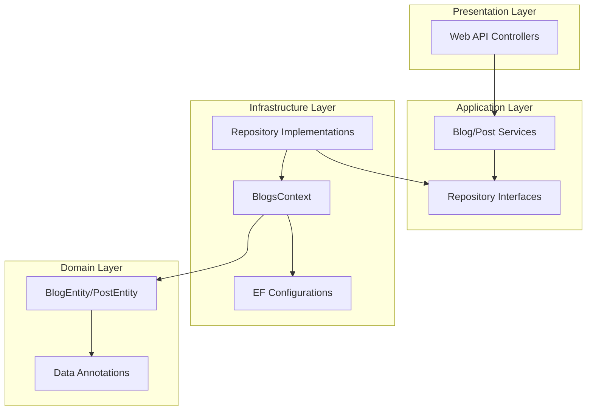
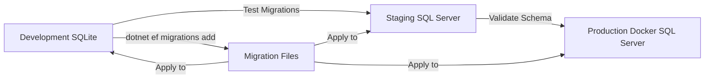

# ASP.NET Core Blog Platform Implementation Plan

## Architecture Overview



---

## **Phase 1: Solution Structure & Domain Layer**

**Layer:** Domain**Tasks:**

1. Create solution structure:
   ```javascript
         BlogPlatform.sln
         ├── src/
         │   ├── BlogPlatform.Domain/          (Class Library)
         │   ├── BlogPlatform.Application/     (Class Library)
         │   ├── BlogPlatform.Infrastructure/  (Class Library)
         │   └── BlogPlatform.Api/             (ASP.NET Core Web API)
         └── tests/
             ├── BlogPlatform.Domain.Tests/    (MSTest Project)
             ├── BlogPlatform.Infrastructure.Tests/
             └── BlogPlatform.Integration.Tests/
   ```


2. Implement `BlogPlatform.Domain/Entities/BlogEntity.cs`:

- Add `BlogId` as primary key property
- Add `[Required]` and `[StringLength(50, MinimumLength = 10)]` on `Name`
- Add `IsActive` boolean property
- Add `ICollection<PostEntity> Articles` navigation property
- Initialize collection in constructor

3. Implement `BlogPlatform.Domain/Entities/PostEntity.cs`:

- Add `PostId` as primary key
- Add `ParentId` foreign key property
- Add `[Required]` and `[StringLength(50, MinimumLength = 10)]` on `Name`
- Add `[Required]` and `[StringLength(1000)]` on `Content`
- Add `Created` (DateTime) and `Updated` (DateTime?) properties
- **Critical Fix:** Add `BlogEntity Blog` navigation property to complete the relationship

4. Create `BlogPlatform.Domain/Interfaces/IBlogRepository.cs`:

- Define `Task<BlogEntity> GetByIdAsync(int id)`
- Define `Task<IEnumerable<BlogEntity>> GetAllAsync()`
- Define `Task<BlogEntity> CreateAsync(BlogEntity blog)`
- Define `Task UpdateAsync(BlogEntity blog)`
- Define `Task DeleteAsync(int id)`

5. Create `BlogPlatform.Domain/Interfaces/IPostRepository.cs`:

- Similar CRUD methods for PostEntity

**Testing Stage:**Create `BlogPlatform.Domain.Tests/Entities/BlogEntityTests.cs`:

```csharp
[TestClass]
public class BlogEntityTests
{
    [TestMethod]
    public void BlogEntity_NameValidation_ShouldFailWhenTooShort()
    {
        // Arrange
        var blog = new BlogEntity { Name = "Short" };
        var context = new ValidationContext(blog);
        var results = new List<ValidationResult>();
        
        // Act
        var isValid = Validator.TryValidateObject(blog, context, results, true);
        
        // Assert
        Assert.IsFalse(isValid);
        Assert.IsTrue(results.Any(r => r.MemberNames.Contains("Name")));
    }
    
    [TestMethod]
    public void BlogEntity_NameValidation_ShouldPassWhenValid()
    {
        // Arrange
        var blog = new BlogEntity { Name = "Valid Blog Name" };
        var context = new ValidationContext(blog);
        var results = new List<ValidationResult>();
        
        // Act
        var isValid = Validator.TryValidateObject(blog, context, results, true);
        
        // Assert
        Assert.IsTrue(isValid);
    }
}
```

Create `BlogPlatform.Domain.Tests/Entities/PostEntityTests.cs` with similar validation tests.**Database Provider:** Not applicable (pure validation testing)**Acceptance Criteria:**

- ✓ All entity properties defined with correct types
- ✓ Navigation properties establish bidirectional relationships
- ✓ Data Annotations present on all required properties
- ✓ Domain validation tests pass using `System.ComponentModel.DataAnnotations.Validator`
- ✓ No dependencies on EF Core in Domain project

**Dependencies:** None---

## **Phase 2: Infrastructure Layer - EF Core Configuration**

**Layer:** Infrastructure**Tasks:**

1. Install NuGet packages in `BlogPlatform.Infrastructure`:

- `Microsoft.EntityFrameworkCore`
- `Microsoft.EntityFrameworkCore.Sqlite` (development)
- `Microsoft.EntityFrameworkCore.SqlServer` (production)
- `Microsoft.EntityFrameworkCore.Design`

2. **Critical Fix:** Implement `BlogPlatform.Infrastructure/Configurations/BlogConfiguration.cs`:
   ```csharp
         public class BlogConfiguration : IEntityTypeConfiguration<BlogEntity>
         {
             public void Configure(EntityTypeBuilder<BlogEntity> builder)
             {
                 builder.ToTable("blogs");
                 builder.HasKey(b => b.BlogId);  // FIX: Explicit PK
                 
                 builder.Property(b => b.BlogId)
                        .HasColumnName("blog_id");  // FIX: snake_case
                 
                 builder.Property(b => b.Name)
                        .IsRequired()
                        .HasMaxLength(50)
                        .HasColumnName("name");
                 
                 // FIX: Custom value conversion for IsActive
                 builder.Property(b => b.IsActive)
                        .HasColumnName("is_active")
                        .HasConversion(
                            v => v ? "Blog is active" : "Blog is not active",
                            v => v == "Blog is active"
                        );
                 
                 // FIX: Explicit relationship mapping to ParentId
                 builder.HasMany(b => b.Articles)
                        .WithOne(p => p.Blog)
                        .HasForeignKey(p => p.ParentId)
                        .OnDelete(DeleteBehavior.Cascade);
             }
         }
   ```


3. **Critical Fix:** Implement `BlogPlatform.Infrastructure/Configurations/PostConfiguration.cs`:
   ```csharp
         public class PostConfiguration : IEntityTypeConfiguration<PostEntity>
         {
             public void Configure(EntityTypeBuilder<PostEntity> builder)
             {
                 builder.ToTable("articles");  // FIX: Correct table name
                 builder.HasKey(p => p.PostId);  // FIX: Explicit PK
                 
                 builder.Property(p => p.PostId)
                        .HasColumnName("post_id");  // FIX: snake_case
                 
                 builder.Property(p => p.ParentId)
                        .HasColumnName("blog_id");  // FIX: FK naming
                 
                 builder.Property(p => p.Name)
                        .IsRequired()
                        .HasMaxLength(50)
                        .HasColumnName("name");
                 
                 builder.Property(p => p.Content)
                        .IsRequired()
                        .HasMaxLength(1000)
                        .HasColumnName("content");
                 
                 builder.Property(p => p.Created)
                        .HasColumnName("created");
                 
                 builder.Property(p => p.Updated)
                        .HasColumnName("updated");
             }
         }
   ```


4. **Critical Fix:** Implement `BlogPlatform.Infrastructure/Data/BlogsContext.cs`:
   ```csharp
         public class BlogsContext : DbContext
         {
             public DbSet<BlogEntity> Blogs { get; set; }
             public DbSet<PostEntity> Posts { get; set; }
             
             public BlogsContext(DbContextOptions<BlogsContext> options) : base(options) { }
             
             protected override void OnModelCreating(ModelBuilder modelBuilder)
             {
                 modelBuilder.ApplyConfiguration(new BlogConfiguration());
                 modelBuilder.ApplyConfiguration(new PostConfiguration());
             }
             
             // FIX: Validation pipeline enforcement
             public override int SaveChanges()
             {
                 ValidateEntities();
                 return base.SaveChanges();
             }
             
             public override Task<int> SaveChangesAsync(CancellationToken cancellationToken = default)
             {
                 ValidateEntities();
                 return base.SaveChangesAsync(cancellationToken);
             }
             
             private void ValidateEntities()
             {
                 var entities = ChangeTracker.Entries()
                     .Where(e => e.State == EntityState.Added || e.State == EntityState.Modified)
                     .Select(e => e.Entity);
                 
                 foreach (var entity in entities)
                 {
                     var validationContext = new ValidationContext(entity);
                     Validator.ValidateObject(entity, validationContext, validateAllProperties: true);
                 }
             }
         }
   ```


5. Implement repositories in `BlogPlatform.Infrastructure/Repositories/`:

- `BlogRepository.cs` implementing `IBlogRepository`
- `PostRepository.cs` implementing `IPostRepository`
- Use async EF Core methods (`ToListAsync`, `FirstOrDefaultAsync`, `AddAsync`, `SaveChangesAsync`)

**Testing Stage:**Create `BlogPlatform.Infrastructure.Tests/Configurations/BlogConfigurationTests.cs`:

```csharp
[TestClass]
public class BlogConfigurationTests
{
    private DbContextOptions<BlogsContext> GetInMemoryOptions()
    {
        return new DbContextOptionsBuilder<BlogsContext>()
            .UseInMemoryDatabase(databaseName: Guid.NewGuid().ToString())
            .Options;
    }
    
    [TestMethod]
    public async Task BlogConfiguration_IsActiveConversion_ShouldStoreAsString()
    {
        // Use SQLite for this test to verify actual column storage
        var options = new DbContextOptionsBuilder<BlogsContext>()
            .UseSqlite("DataSource=:memory:")
            .Options;
        
        using var context = new BlogsContext(options);
        await context.Database.OpenConnectionAsync();
        await context.Database.EnsureCreatedAsync();
        
        // Arrange
        var blog = new BlogEntity { Name = "Test Blog", IsActive = true };
        
        // Act
        context.Blogs.Add(blog);
        await context.SaveChangesAsync();
        
        // Assert
        var rawSql = context.Database.SqlQueryRaw<string>(
            "SELECT is_active FROM blogs WHERE blog_id = {0}", blog.BlogId);
        var storedValue = await rawSql.FirstOrDefaultAsync();
        Assert.AreEqual("Blog is active", storedValue);
    }
    
    [TestMethod]
    public void BlogsContext_SaveChanges_ShouldValidateBeforeSaving()
    {
        // Arrange
        var options = GetInMemoryOptions();
        using var context = new BlogsContext(options);
        var invalidBlog = new BlogEntity { Name = "Bad" }; // Too short
        
        // Act & Assert
        context.Blogs.Add(invalidBlog);
        Assert.ThrowsException<ValidationException>(() => context.SaveChanges());
    }
}
```

Create `BlogPlatform.Infrastructure.Tests/Configurations/PostConfigurationTests.cs` to verify:

- Table name is "articles"
- Columns use snake_case
- Foreign key constraint to blogs table

Create `BlogPlatform.Infrastructure.Tests/Repositories/BlogRepositoryTests.cs`:

```csharp
[TestClass]
public class BlogRepositoryTests
{
    [TestMethod]
    public async Task CreateAsync_ValidBlog_ShouldReturnBlogWithId()
    {
        // Arrange
        var options = new DbContextOptionsBuilder<BlogsContext>()
            .UseInMemoryDatabase(databaseName: Guid.NewGuid().ToString())
            .Options;
        
        using var context = new BlogsContext(options);
        var repository = new BlogRepository(context);
        var blog = new BlogEntity { Name = "Test Blog Name", IsActive = true };
        
        // Act
        var result = await repository.CreateAsync(blog);
        
        // Assert
        Assert.IsNotNull(result);
        Assert.IsTrue(result.BlogId > 0);
    }
}
```

**Database Provider:**

- InMemory for basic repository CRUD tests
- SQLite for configuration/conversion validation tests

**Acceptance Criteria:**

- ✓ All 6 critical bugs fixed (PK, relationships, naming, conversion, validation)
- ✓ Fluent API configurations apply correctly
- ✓ `SaveChanges` throws `ValidationException` for invalid data
- ✓ SQLite tests verify snake_case column names in actual database
- ✓ IsActive stores as string, not bit

**Dependencies:** Phase 1 complete**Database Considerations:**

- SQLite: Uses `TEXT` type for IsActive conversion
- SQL Server: Will use `NVARCHAR` type for IsActive conversion

---

## **Phase 3: Application Layer - Services & Business Logic**

**Layer:** Application**Tasks:**

1. Install NuGet packages in `BlogPlatform.Application`:

- Reference `BlogPlatform.Domain` project

2. Create DTOs in `BlogPlatform.Application/DTOs/`:

- `BlogDto.cs` (Id, Name, IsActive, ArticleCount)
- `PostDto.cs` (Id, Name, Content, Created, Updated, BlogId)
- `CreateBlogRequest.cs` (Name, IsActive)
- `UpdateBlogRequest.cs` (Name, IsActive)
- `CreatePostRequest.cs` (Name, Content, BlogId)
- `UpdatePostRequest.cs` (Name, Content)

3. Implement `BlogPlatform.Application/Services/BlogService.cs`:
   ```csharp
         public class BlogService : IBlogService
         {
             private readonly IBlogRepository _blogRepository;
             
             public async Task<BlogDto> CreateBlogAsync(CreateBlogRequest request)
             {
                 var blog = new BlogEntity
                 {
                     Name = request.Name,
                     IsActive = request.IsActive
                 };
                 
                 var created = await _blogRepository.CreateAsync(blog);
                 return MapToDto(created);
             }
             
             public async Task<IEnumerable<BlogDto>> GetAllBlogsAsync()
             {
                 var blogs = await _blogRepository.GetAllAsync();
                 return blogs.Select(MapToDto);
             }
             
             // Additional methods...
         }
   ```


4. Implement `BlogPlatform.Application/Services/PostService.cs` with similar CRUD operations
5. Create `BlogPlatform.Application/Services/Interfaces/IBlogService.cs` and `IPostService.cs`

**Testing Stage:**Create `BlogPlatform.Application.Tests/Services/BlogServiceTests.cs`:

```csharp
[TestClass]
public class BlogServiceTests
{
    private Mock<IBlogRepository> _mockRepository;
    private BlogService _service;
    
    [TestInitialize]
    public void Setup()
    {
        _mockRepository = new Mock<IBlogRepository>();
        _service = new BlogService(_mockRepository.Object);
    }
    
    [TestMethod]
    public async Task CreateBlogAsync_ValidRequest_ShouldReturnDto()
    {
        // Arrange
        var request = new CreateBlogRequest { Name = "Test Blog", IsActive = true };
        var expectedBlog = new BlogEntity { BlogId = 1, Name = "Test Blog", IsActive = true };
        _mockRepository.Setup(r => r.CreateAsync(It.IsAny<BlogEntity>()))
                       .ReturnsAsync(expectedBlog);
        
        // Act
        var result = await _service.CreateBlogAsync(request);
        
        // Assert
        Assert.IsNotNull(result);
        Assert.AreEqual(1, result.Id);
        Assert.AreEqual("Test Blog", result.Name);
        _mockRepository.Verify(r => r.CreateAsync(It.IsAny<BlogEntity>()), Times.Once);
    }
    
    [TestMethod]
    public async Task CreateBlogAsync_InvalidName_ShouldThrowValidationException()
    {
        // Arrange
        var request = new CreateBlogRequest { Name = "Bad", IsActive = true };
        
        // Act & Assert
        await Assert.ThrowsExceptionAsync<ValidationException>(
            () => _service.CreateBlogAsync(request));
    }
}
```

**Database Provider:** Not applicable (mocked repositories)**Acceptance Criteria:**

- ✓ Services implement business logic and orchestration
- ✓ DTOs separate API contracts from domain entities
- ✓ Services properly map between entities and DTOs
- ✓ Unit tests verify service logic using mocked repositories
- ✓ All async operations properly awaited

**Dependencies:** Phase 1 & 2 complete---

## **Phase 4: Presentation Layer - Web API**

**Layer:** Presentation**Tasks:**

1. Configure `BlogPlatform.Api/Program.cs`:
   ```csharp
         var builder = WebApplication.CreateBuilder(args);
         
         // Register DbContext with SQLite for development
         var connectionString = builder.Configuration.GetConnectionString("DefaultConnection");
         builder.Services.AddDbContext<BlogsContext>(options =>
         {
             if (builder.Environment.IsDevelopment())
                 options.UseSqlite(connectionString);
             else
                 options.UseSqlServer(connectionString);
         });
         
         // Register repositories
         builder.Services.AddScoped<IBlogRepository, BlogRepository>();
         builder.Services.AddScoped<IPostRepository, PostRepository>();
         
         // Register services
         builder.Services.AddScoped<IBlogService, BlogService>();
         builder.Services.AddScoped<IPostService, PostService>();
         
         builder.Services.AddControllers();
         builder.Services.AddEndpointsApiExplorer();
         builder.Services.AddSwaggerGen();
         
         var app = builder.Build();
         
         if (app.Environment.IsDevelopment())
         {
             app.UseSwagger();
             app.UseSwaggerUI();
         }
         
         app.UseHttpsRedirection();
         app.UseAuthorization();
         app.MapControllers();
         app.Run();
   ```


2. Create `BlogPlatform.Api/appsettings.json`:
   ```json
         {
           "ConnectionStrings": {
             "DefaultConnection": "Data Source=blogs.db"
           }
         }
   ```


3. Create `BlogPlatform.Api/appsettings.Production.json`:
   ```json
         {
           "ConnectionStrings": {
             "DefaultConnection": "Server=sql-server;Database=BlogPlatform;User Id=sa;Password=${DB_PASSWORD};TrustServerCertificate=True"
           }
         }
   ```


4. Implement `BlogPlatform.Api/Controllers/BlogsController.cs`:
   ```csharp
         [ApiController]
         [Route("api/[controller]")]
         public class BlogsController : ControllerBase
         {
             private readonly IBlogService _blogService;
             
             public BlogsController(IBlogService blogService)
             {
                 _blogService = blogService;
             }
             
             [HttpGet]
             public async Task<ActionResult<IEnumerable<BlogDto>>> GetAll()
             {
                 var blogs = await _blogService.GetAllBlogsAsync();
                 return Ok(blogs);
             }
             
             [HttpGet("{id}")]
             public async Task<ActionResult<BlogDto>> GetById(int id)
             {
                 var blog = await _blogService.GetBlogByIdAsync(id);
                 if (blog == null) return NotFound();
                 return Ok(blog);
             }
             
             [HttpPost]
             public async Task<ActionResult<BlogDto>> Create([FromBody] CreateBlogRequest request)
             {
                 try
                 {
                     var blog = await _blogService.CreateBlogAsync(request);
                     return CreatedAtAction(nameof(GetById), new { id = blog.Id }, blog);
                 }
                 catch (ValidationException ex)
                 {
                     return BadRequest(new { error = ex.Message });
                 }
             }
             
             [HttpPut("{id}")]
             public async Task<ActionResult> Update(int id, [FromBody] UpdateBlogRequest request)
             {
                 try
                 {
                     await _blogService.UpdateBlogAsync(id, request);
                     return NoContent();
                 }
                 catch (ValidationException ex)
                 {
                     return BadRequest(new { error = ex.Message });
                 }
             }
             
             [HttpDelete("{id}")]
             public async Task<ActionResult> Delete(int id)
             {
                 await _blogService.DeleteBlogAsync(id);
                 return NoContent();
             }
         }
   ```


5. Implement `BlogPlatform.Api/Controllers/PostsController.cs` with similar CRUD endpoints

**Testing Stage:**Create `BlogPlatform.Api.Tests/Controllers/BlogsControllerTests.cs`:

```csharp
[TestClass]
public class BlogsControllerTests
{
    private Mock<IBlogService> _mockService;
    private BlogsController _controller;
    
    [TestInitialize]
    public void Setup()
    {
        _mockService = new Mock<IBlogService>();
        _controller = new BlogsController(_mockService.Object);
    }
    
    [TestMethod]
    public async Task GetAll_ShouldReturnOkWithBlogs()
    {
        // Arrange
        var blogs = new List<BlogDto>
        {
            new BlogDto { Id = 1, Name = "Blog 1", IsActive = true }
        };
        _mockService.Setup(s => s.GetAllBlogsAsync()).ReturnsAsync(blogs);
        
        // Act
        var result = await _controller.GetAll();
        
        // Assert
        var okResult = result.Result as OkObjectResult;
        Assert.IsNotNull(okResult);
        Assert.AreEqual(200, okResult.StatusCode);
    }
    
    [TestMethod]
    public async Task Create_InvalidData_ShouldReturnBadRequest()
    {
        // Arrange
        var request = new CreateBlogRequest { Name = "Bad", IsActive = true };
        _mockService.Setup(s => s.CreateBlogAsync(request))
                    .ThrowsAsync(new ValidationException("Name too short"));
        
        // Act
        var result = await _controller.Create(request);
        
        // Assert
        var badRequestResult = result.Result as BadRequestObjectResult;
        Assert.IsNotNull(badRequestResult);
        Assert.AreEqual(400, badRequestResult.StatusCode);
    }
}
```

**Database Provider:** Not applicable (mocked services)**Acceptance Criteria:**

- ✓ All CRUD endpoints implemented for Blogs and Posts
- ✓ Proper HTTP status codes returned (200, 201, 204, 400, 404)
- ✓ ValidationException caught and returned as 400 BadRequest
- ✓ Dependency injection configured correctly
- ✓ Swagger documentation generated

**Dependencies:** Phase 1, 2, & 3 complete---

## **Phase 5: Database Migrations & Environment Configuration**

**Layer:** Infrastructure**Tasks:**

1. Install EF Core CLI tools globally:
   ```bash
         dotnet tool install --global dotnet-ef
   ```


2. Create initial migration from Infrastructure project:
   ```bash
         cd src/BlogPlatform.Infrastructure
         dotnet ef migrations add InitialStructure --startup-project ../BlogPlatform.Api
   ```


3. **Critical Verification:** Inspect generated migration file to confirm:

- Table names: `blogs` and `articles` (not `Blogs`, `Posts`)
- Column names: `blog_id`, `post_id`, `is_active`, etc. (snake_case)
- IsActive column type: `nvarchar` or `TEXT` (not `bit`)
- Foreign key: `blog_id` in `articles` references `blog_id` in `blogs`
- Cascade delete configured

4. Create Docker configuration for SQL Server:

`docker-compose.yml`:

   ```yaml
         version: '3.8'
         services:
           sql-server:
             image: mcr.microsoft.com/mssql/server:2022-latest
             environment:
    - ACCEPT_EULA=Y
    - SA_PASSWORD=YourStrong!Password123
    - MSSQL_PID=Developer
             ports:
    - "1433:1433"
             volumes:
    - sqlserver_data:/var/opt/mssql
           
           api:
             build:
               context: .
               dockerfile: Dockerfile
             environment:
    - ASPNETCORE_ENVIRONMENT=Production
    - DB_PASSWORD=YourStrong!Password123
             ports:
    - "5000:80"
             depends_on:
    - sql-server
         
         volumes:
           sqlserver_data:
   ```


5. Create `Dockerfile` in solution root:
   ```dockerfile
         FROM mcr.microsoft.com/dotnet/aspnet:8.0 AS base
         WORKDIR /app
         EXPOSE 80
         
         FROM mcr.microsoft.com/dotnet/sdk:8.0 AS build
         WORKDIR /src
         COPY ["src/BlogPlatform.Api/BlogPlatform.Api.csproj", "src/BlogPlatform.Api/"]
         COPY ["src/BlogPlatform.Application/BlogPlatform.Application.csproj", "src/BlogPlatform.Application/"]
         COPY ["src/BlogPlatform.Infrastructure/BlogPlatform.Infrastructure.csproj", "src/BlogPlatform.Infrastructure/"]
         COPY ["src/BlogPlatform.Domain/BlogPlatform.Domain.csproj", "src/BlogPlatform.Domain/"]
         RUN dotnet restore "src/BlogPlatform.Api/BlogPlatform.Api.csproj"
         COPY . .
         WORKDIR "/src/src/BlogPlatform.Api"
         RUN dotnet build "BlogPlatform.Api.csproj" -c Release -o /app/build
         
         FROM build AS publish
         RUN dotnet publish "BlogPlatform.Api.csproj" -c Release -o /app/publish
         
         FROM base AS final
         WORKDIR /app
         COPY --from=publish /app/publish .
         ENTRYPOINT ["dotnet", "BlogPlatform.Api.dll"]
   ```


6. Create migration script for Docker: `src/BlogPlatform.Api/migrate.sh`:
   ```bash
         #!/bin/bash
         dotnet ef database update --project ../BlogPlatform.Infrastructure --startup-project .
   ```


**Testing Stage:**Create `BlogPlatform.Integration.Tests/DatabaseMigrationTests.cs`:

```csharp
[TestClass]
public class DatabaseMigrationTests
{
    [TestMethod]
    public async Task Migration_SQLite_ShouldCreateCorrectSchema()
    {
        // Arrange
        var options = new DbContextOptionsBuilder<BlogsContext>()
            .UseSqlite("DataSource=:memory:")
            .Options;
        
        using var context = new BlogsContext(options);
        await context.Database.OpenConnectionAsync();
        
        // Act
        await context.Database.MigrateAsync();
        
        // Assert - Verify tables exist
        var tables = await context.Database.SqlQueryRaw<string>(
            "SELECT name FROM sqlite_master WHERE type='table'").ToListAsync();
        Assert.IsTrue(tables.Contains("blogs"));
        Assert.IsTrue(tables.Contains("articles"));
        
        // Verify column names
        var blogColumns = await context.Database.SqlQueryRaw<string>(
            "PRAGMA table_info(blogs)").ToListAsync();
        Assert.IsTrue(blogColumns.Any(c => c.Contains("blog_id")));
        Assert.IsTrue(blogColumns.Any(c => c.Contains("is_active")));
    }
    
    [TestMethod]
    [TestCategory("Integration")]
    public async Task Migration_SqlServer_ShouldCreateCorrectSchema()
    {
        // This test requires SQL Server running (CI/CD or manual)
        var connectionString = "Server=localhost;Database=BlogPlatform_Test;User Id=sa;Password=Test!Pass123;TrustServerCertificate=True";
        var options = new DbContextOptionsBuilder<BlogsContext>()
            .UseSqlServer(connectionString)
            .Options;
        
        using var context = new BlogsContext(options);
        
        // Act
        await context.Database.MigrateAsync();
        
        // Assert
        var tables = await context.Database.SqlQueryRaw<string>(
            "SELECT TABLE_NAME FROM INFORMATION_SCHEMA.TABLES WHERE TABLE_TYPE='BASE TABLE'")
            .ToListAsync();
        Assert.IsTrue(tables.Contains("blogs"));
        Assert.IsTrue(tables.Contains("articles"));
    }
}
```

**Database Provider:**

- SQLite for development migration verification
- SQL Server for production migration verification (requires Docker)

**Acceptance Criteria:**

- ✓ Migration files generated with correct snake_case naming
- ✓ SQLite database creates successfully in development
- ✓ SQL Server database creates successfully in Docker
- ✓ IsActive stores as string type (verified via SQL query)
- ✓ Foreign key constraints properly established
- ✓ Cascade delete works as expected

**Dependencies:** Phase 1, 2, 3, & 4 complete**Database Considerations:**

- **SQLite Development:** Connection string uses `Data Source=blogs.db` for file-based database
- **SQL Server Production:** Connection string uses environment variable for password security
- **Docker:** Ensure migrations run via startup script or manual `dotnet ef database update`
- **Type Differences:** 
- SQLite `TEXT` vs SQL Server `NVARCHAR(MAX)` for IsActive
- Both handle the string conversion correctly
- **Migration Path:** Can develop locally with SQLite, test migrations, then apply same migrations to SQL Server in production

---

## **Phase 6: End-to-End Integration Testing**

**Layer:** Integration (All Layers)**Tasks:**

1. Create `BlogPlatform.Integration.Tests/BlogEndToEndTests.cs`:
   ```csharp
         [TestClass]
         public class BlogEndToEndTests
         {
             private WebApplicationFactory<Program> _factory;
             private HttpClient _client;
             
             [TestInitialize]
             public void Setup()
             {
                 _factory = new WebApplicationFactory<Program>()
                     .WithWebHostBuilder(builder =>
                     {
                         builder.ConfigureServices(services =>
                         {
                             // Replace DbContext with InMemory for integration tests
                             var descriptor = services.SingleOrDefault(
                                 d => d.ServiceType == typeof(DbContextOptions<BlogsContext>));
                             if (descriptor != null) services.Remove(descriptor);
                             
                             services.AddDbContext<BlogsContext>(options =>
                             {
                                 options.UseInMemoryDatabase("IntegrationTests");
                             });
                         });
                     });
                 
                 _client = _factory.CreateClient();
             }
             
             [TestMethod]
             public async Task CreateBlog_ValidData_ShouldReturnCreated()
             {
                 // Arrange
                 var request = new CreateBlogRequest { Name = "Integration Test Blog", IsActive = true };
                 var content = new StringContent(
                     JsonSerializer.Serialize(request),
                     Encoding.UTF8,
                     "application/json");
                 
                 // Act
                 var response = await _client.PostAsync("/api/blogs", content);
                 
                 // Assert
                 Assert.AreEqual(HttpStatusCode.Created, response.StatusCode);
                 var blogDto = await JsonSerializer.DeserializeAsync<BlogDto>(
                     await response.Content.ReadAsStreamAsync());
                 Assert.IsNotNull(blogDto);
                 Assert.AreEqual("Integration Test Blog", blogDto.Name);
             }
             
             [TestMethod]
             public async Task CreateBlog_InvalidName_ShouldReturnBadRequest()
             {
                 // Arrange
                 var request = new CreateBlogRequest { Name = "Bad", IsActive = true };
                 var content = new StringContent(
                     JsonSerializer.Serialize(request),
                     Encoding.UTF8,
                     "application/json");
                 
                 // Act
                 var response = await _client.PostAsync("/api/blogs", content);
                 
                 // Assert
                 Assert.AreEqual(HttpStatusCode.BadRequest, response.StatusCode);
             }
             
             [TestMethod]
             public async Task CreatePostForBlog_ValidData_ShouldLinkCorrectly()
             {
                 // Arrange - Create blog first
                 var blogRequest = new CreateBlogRequest { Name = "Blog For Posts", IsActive = true };
                 var blogContent = new StringContent(
                     JsonSerializer.Serialize(blogRequest),
                     Encoding.UTF8,
                     "application/json");
                 var blogResponse = await _client.PostAsync("/api/blogs", blogContent);
                 var blog = await JsonSerializer.DeserializeAsync<BlogDto>(
                     await blogResponse.Content.ReadAsStreamAsync());
                 
                 // Act - Create post
                 var postRequest = new CreatePostRequest
                 {
                     Name = "Test Post Name",
                     Content = "This is test content for the post.",
                     BlogId = blog.Id
                 };
                 var postContent = new StringContent(
                     JsonSerializer.Serialize(postRequest),
                     Encoding.UTF8,
                     "application/json");
                 var postResponse = await _client.PostAsync("/api/posts", postContent);
                 
                 // Assert
                 Assert.AreEqual(HttpStatusCode.Created, postResponse.StatusCode);
                 var post = await JsonSerializer.DeserializeAsync<PostDto>(
                     await postResponse.Content.ReadAsStreamAsync());
                 Assert.AreEqual(blog.Id, post.BlogId);
             }
         }
   ```


2. Create `BlogPlatform.Integration.Tests/ValidationPipelineTests.cs`:
   ```csharp
         [TestClass]
         public class ValidationPipelineTests
         {
             [TestMethod]
             public async Task DbContext_SaveChanges_ShouldValidateBeforeDatabase()
             {
                 // Arrange
                 var options = new DbContextOptionsBuilder<BlogsContext>()
                     .UseInMemoryDatabase("ValidationTests")
                     .Options;
                 
                 using var context = new BlogsContext(options);
                 var invalidBlog = new BlogEntity
                 {
                     Name = "Too long name exceeding fifty character maximum limit here",
                     IsActive = true
                 };
                 
                 // Act & Assert
                 context.Blogs.Add(invalidBlog);
                 var exception = await Assert.ThrowsExceptionAsync<ValidationException>(
                     () => context.SaveChangesAsync());
                 Assert.IsTrue(exception.Message.Contains("Name"));
             }
         }
   ```


3. Create performance benchmark test (optional):
   ```csharp
         [TestMethod]
         public async Task CreateMultipleBlogs_ShouldCompleteInReasonableTime()
         {
             // Arrange
             var stopwatch = Stopwatch.StartNew();
             var tasks = new List<Task>();
             
             // Act - Create 100 blogs concurrently
             for (int i = 0; i < 100; i++)
             {
                 var request = new CreateBlogRequest
                 {
                     Name = $"Performance Test Blog {i}",
                     IsActive = true
                 };
                 var content = new StringContent(
                     JsonSerializer.Serialize(request),
                     Encoding.UTF8,
                     "application/json");
                 tasks.Add(_client.PostAsync("/api/blogs", content));
             }
             await Task.WhenAll(tasks);
             stopwatch.Stop();
             
             // Assert - Should complete in under 5 seconds
             Assert.IsTrue(stopwatch.ElapsedMilliseconds < 5000);
         }
   ```


**Database Provider:** InMemory for API integration tests, SQLite for database-specific tests**Acceptance Criteria:**

- ✓ Full CRUD workflow tests pass for both Blogs and Posts
- ✓ Validation pipeline enforced at application level (400 responses)
- ✓ Relationship integrity maintained (Posts link to Blogs correctly)
- ✓ All HTTP status codes correct (200, 201, 204, 400, 404)
- ✓ JSON serialization/deserialization works correctly
- ✓ Performance acceptable under concurrent load

**Dependencies:** All previous phases complete---

## Summary of Critical Bug Fixes

| Bug | Phase | Fix Location ||-----|-------|--------------|| 1. Missing Primary Key Configuration | Phase 2 | `BlogConfiguration.cs` / `PostConfiguration.cs` - `HasKey()` || 2. Ambiguous Relationships | Phase 1 & 2 | `PostEntity.cs` navigation + `BlogConfiguration.cs` `HasForeignKey()` || 3. Incorrect Table Names | Phase 2 | `ToTable("blogs")` and `ToTable("articles")` || 4. Incorrect Column Names | Phase 2 | `HasColumnName("blog_id")` for all properties || 5. Missing IsActive Conversion | Phase 2 | `BlogConfiguration.cs` - `HasConversion()` || 6. No Validation Pipeline | Phase 2 | `BlogsContext.cs` - `SaveChanges()` override |

## Deployment Workflow

