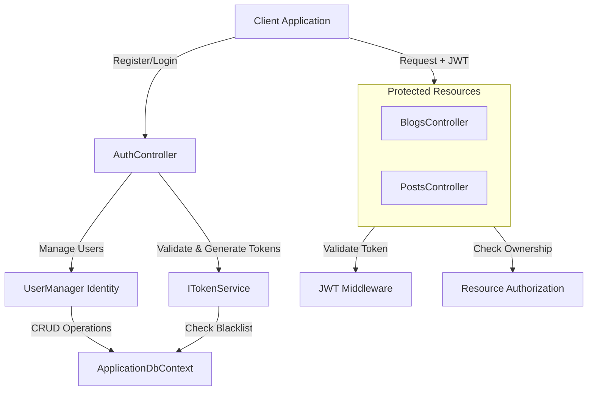

# JWT Authentication & Authorization Implementation Plan

## Overview

This plan implements a production-ready JWT authentication system for the Blog Platform using ASP.NET Core Identity with the following features:

- **Dual-token system**: 15-minute access tokens, 7-day refresh tokens
- **Role-based access control**: Admin and User roles
- **Resource ownership**: Users can only edit their own blogs/posts; Admins can edit all content
- **Compromised token blacklist**: Track and remove revoked refresh tokens
- **Email service infrastructure**: Stub implementation for future email confirmation/password reset

## Architecture Overview



## Phase 1: Database Schema & Entity Models

### 1.1 Add Identity Entities

ASP.NET Core Identity will create these tables automatically:

- `AspNetUsers` (extends IdentityUser)
- `AspNetRoles` (Admin, User)
- `AspNetUserRoles` (junction table)
- `AspNetUserClaims`, `AspNetUserLogins`, `AspNetUserTokens`, `AspNetRoleClaims`

Create custom `ApplicationUser` entity extending `IdentityUser`:**Location**: [`src/BlogPlatform.Domain/Entities/ApplicationUser.cs`](src/BlogPlatform.Domain/Entities/ApplicationUser.cs)

```csharp
public class ApplicationUser : IdentityUser
{
    [Required]
    [StringLength(100)]
    public string FullName { get; set; } = string.Empty;
    
    public DateTime CreatedAt { get; set; } = DateTime.UtcNow;
    public DateTime? LastLoginAt { get; set; }
    
    // Navigation properties for owned resources
    public ICollection<BlogEntity> Blogs { get; set; } = new List<BlogEntity>();
    public ICollection<PostEntity> Posts { get; set; } = new List<PostEntity>();
}
```

### 1.2 Create Compromised Refresh Tokens Table

**Location**: [`src/BlogPlatform.Domain/Entities/CompromisedRefreshToken.cs`](src/BlogPlatform.Domain/Entities/CompromisedRefreshToken.cs)

```csharp
public class CompromisedRefreshToken
{
    public int Id { get; set; }
    
    [Required]
    public string TokenHash { get; set; } = string.Empty;
    
    public DateTime CompromisedAt { get; set; } = DateTime.UtcNow;
    
    public DateTime ExpiresAt { get; set; }
    
    public string? Reason { get; set; }
}
```

### 1.3 Update Existing Entities for Ownership

Add `UserId` (author) to [`src/BlogPlatform.Domain/Entities/BlogEntity.cs`](src/BlogPlatform.Domain/Entities/BlogEntity.cs):

```csharp
[Required]
public string UserId { get; set; } = string.Empty;

public ApplicationUser User { get; set; } = null!;
```

Add `UserId` (author) to [`src/BlogPlatform.Domain/Entities/PostEntity.cs`](src/BlogPlatform.Domain/Entities/PostEntity.cs):

```csharp
[Required]
public string UserId { get; set; } = string.Empty;

public ApplicationUser User { get; set; } = null!;
```

### 1.4 Update DbContext

**Location**: [`src/BlogPlatform.Infrastructure/Data/BlogsContext.cs`](src/BlogPlatform.Infrastructure/Data/BlogsContext.cs)Change `BlogsContext` to extend `IdentityDbContext<ApplicationUser>`:

```csharp
public class BlogsContext : IdentityDbContext<ApplicationUser>
{
    public DbSet<BlogEntity> Blogs { get; set; } = null!;
    public DbSet<PostEntity> Posts { get; set; } = null!;
    public DbSet<CompromisedRefreshToken> CompromisedRefreshTokens { get; set; } = null!;
    
    // ... existing code ...
    
    protected override void OnModelCreating(ModelBuilder modelBuilder)
    {
        base.OnModelCreating(modelBuilder); // CRITICAL: Call Identity configuration
        
        modelBuilder.ApplyConfiguration(new BlogConfiguration());
        modelBuilder.ApplyConfiguration(new PostConfiguration());
        modelBuilder.ApplyConfiguration(new CompromisedRefreshTokenConfiguration());
        
        // Configure relationships
        modelBuilder.Entity<BlogEntity>()
            .HasOne(b => b.User)
            .WithMany(u => u.Blogs)
            .HasForeignKey(b => b.UserId)
            .OnDelete(DeleteBehavior.Cascade);
            
        modelBuilder.Entity<PostEntity>()
            .HasOne(p => p.User)
            .WithMany(u => u.Posts)
            .HasForeignKey(p => p.UserId)
            .OnDelete(DeleteBehavior.Cascade);
    }
}
```

### 1.5 Entity Configurations

**Location**: [`src/BlogPlatform.Infrastructure/Configurations/CompromisedRefreshTokenConfiguration.cs`](src/BlogPlatform.Infrastructure/Configurations/CompromisedRefreshTokenConfiguration.cs)

```csharp
public class CompromisedRefreshTokenConfiguration : IEntityTypeConfiguration<CompromisedRefreshToken>
{
    public void Configure(EntityTypeBuilder<CompromisedRefreshToken> builder)
    {
        builder.HasKey(t => t.Id);
        builder.HasIndex(t => t.TokenHash).IsUnique();
        builder.HasIndex(t => t.ExpiresAt);
        builder.Property(t => t.TokenHash).HasMaxLength(512);
    }
}
```

## Phase 2: NuGet Package Installation

Add to [`src/BlogPlatform.Infrastructure/BlogPlatform.Infrastructure.csproj`](src/BlogPlatform.Infrastructure/BlogPlatform.Infrastructure.csproj):

```xml
<PackageReference Include="Microsoft.AspNetCore.Identity.EntityFrameworkCore" Version="10.0.1" />
```

Add to [`src/BlogPlatform.Api/BlogPlatform.Api.csproj`](src/BlogPlatform.Api/BlogPlatform.Api.csproj):

```xml
<PackageReference Include="Microsoft.AspNetCore.Authentication.JwtBearer" Version="10.0.0" />
<PackageReference Include="System.IdentityModel.Tokens.Jwt" Version="8.2.1" />
```

Add to [`src/BlogPlatform.Application/BlogPlatform.Application.csproj`](src/BlogPlatform.Application/BlogPlatform.Application.csproj):

```xml
<PackageReference Include="Microsoft.AspNetCore.Identity" Version="2.2.0" />
```

## Phase 3: Configuration Setup

### 3.1 JWT Settings in appsettings.json

Update [`src/BlogPlatform.Api/appsettings.json`](src/BlogPlatform.Api/appsettings.json):

```json
{
  "Logging": {
    "LogLevel": {
      "Default": "Information",
      "Microsoft.AspNetCore": "Warning"
    }
  },
  "AllowedHosts": "*",
  "ConnectionStrings": {
    "DefaultConnection": "Data Source=blogs.db"
  },
  "JwtSettings": {
    "SecretKey": "REPLACE_THIS_WITH_STRONG_SECRET_KEY_MIN_32_CHARS",
    "Issuer": "BlogPlatformApi",
    "Audience": "BlogPlatformClient",
    "AccessTokenExpirationMinutes": 15,
    "RefreshTokenExpirationDays": 7
  }
}
```

Update [`src/BlogPlatform.Api/appsettings.Production.json`](src/BlogPlatform.Api/appsettings.Production.json):

```json
{
  "JwtSettings": {
    "SecretKey": "${JWT_SECRET_KEY}",
    "Issuer": "${JWT_ISSUER}",
    "Audience": "${JWT_AUDIENCE}"
  },
  "ConnectionStrings": {
    "DefaultConnection": "${CONNECTION_STRING}"
  }
}
```

### 3.2 JWT Settings Model

**Location**: [`src/BlogPlatform.Application/Configuration/JwtSettings.cs`](src/BlogPlatform.Application/Configuration/JwtSettings.cs)

```csharp
public class JwtSettings
{
    public string SecretKey { get; set; } = string.Empty;
    public string Issuer { get; set; } = string.Empty;
    public string Audience { get; set; } = string.Empty;
    public int AccessTokenExpirationMinutes { get; set; } = 15;
    public int RefreshTokenExpirationDays { get; set; } = 7;
}
```

## Phase 4: Authentication Services Implementation

### 4.1 Token Service Interface

**Location**: [`src/BlogPlatform.Application/Services/Interfaces/ITokenService.cs`](src/BlogPlatform.Application/Services/Interfaces/ITokenService.cs)

```csharp
public interface ITokenService
{
    Task<string> GenerateAccessTokenAsync(ApplicationUser user, IList<string> roles);
    string GenerateRefreshToken();
    Task<bool> ValidateAccessTokenAsync(string token);
    Task<ClaimsPrincipal?> GetPrincipalFromExpiredTokenAsync(string token);
    Task<bool> IsRefreshTokenCompromisedAsync(string refreshToken);
    Task CompromiseRefreshTokenAsync(string refreshToken, string reason);
    Task CleanupExpiredCompromisedTokensAsync();
}
```

### 4.2 Token Service Implementation

**Location**: [`src/BlogPlatform.Application/Services/TokenService.cs`](src/BlogPlatform.Application/Services/TokenService.cs)Key responsibilities:

- Generate JWT access tokens with user claims (UserId, Email, Roles)
- Generate cryptographically secure refresh tokens
- Validate tokens and extract claims
- Check refresh token blacklist
- Add tokens to blacklist with reason
- Periodic cleanup of expired compromised tokens

Implementation details:

- Use `System.Security.Cryptography.RandomNumberGenerator` for refresh tokens
- Use `JwtSecurityTokenHandler` for access token generation
- Include claims: `ClaimTypes.NameIdentifier` (UserId), `ClaimTypes.Email`, `ClaimTypes.Role`
- Hash refresh tokens before storing (SHA256)

### 4.3 Authentication Service Interface

**Location**: [`src/BlogPlatform.Application/Services/Interfaces/IAuthService.cs`](src/BlogPlatform.Application/Services/Interfaces/IAuthService.cs)

```csharp
public interface IAuthService
{
    Task<AuthenticationResult> RegisterAsync(RegisterRequest request);
    Task<AuthenticationResult> LoginAsync(LoginRequest request);
    Task<AuthenticationResult> RefreshTokenAsync(string accessToken, string refreshToken);
    Task<bool> LogoutAsync(string userId, string refreshToken);
    Task<bool> RevokeAllTokensAsync(string userId);
}
```

### 4.4 Authentication DTOs

**Location**: [`src/BlogPlatform.Application/DTOs/Auth/`](src/BlogPlatform.Application/DTOs/Auth/)

- `RegisterRequest.cs`: Email, Password, ConfirmPassword, FullName
- `LoginRequest.cs`: Email, Password
- `RefreshTokenRequest.cs`: AccessToken, RefreshToken
- `AuthenticationResult.cs`: Success, AccessToken, RefreshToken, UserId, Email, Roles, Errors

### 4.5 Email Service (Stub Implementation)

**Location**: [`src/BlogPlatform.Application/Services/Interfaces/IEmailService.cs`](src/BlogPlatform.Application/Services/Interfaces/IEmailService.cs)

```csharp
public interface IEmailService
{
    Task SendEmailConfirmationAsync(string email, string confirmationLink);
    Task SendPasswordResetAsync(string email, string resetLink);
}
```

**Location**: [`src/BlogPlatform.Application/Services/EmailService.cs`](src/BlogPlatform.Application/Services/EmailService.cs)Stub implementation that logs email operations for future integration.

## Phase 5: Authorization Implementation

### 5.1 Authorization Policies

Define policies in [`src/BlogPlatform.Api/Program.cs`](src/BlogPlatform.Api/Program.cs):

```csharp
builder.Services.AddAuthorization(options =>
{
    options.AddPolicy("AdminOnly", policy => policy.RequireRole("Admin"));
    options.AddPolicy("UserOrAdmin", policy => policy.RequireRole("User", "Admin"));
    options.AddPolicy("BlogOwner", policy => 
        policy.Requirements.Add(new ResourceOwnerRequirement()));
    options.AddPolicy("PostOwner", policy => 
        policy.Requirements.Add(new ResourceOwnerRequirement()));
});
```

### 5.2 Resource Owner Authorization Handler

**Location**: [`src/BlogPlatform.Application/Authorization/ResourceOwnerRequirement.cs`](src/BlogPlatform.Application/Authorization/ResourceOwnerRequirement.cs)

```csharp
public class ResourceOwnerRequirement : IAuthorizationRequirement { }
```

**Location**: [`src/BlogPlatform.Application/Authorization/ResourceOwnerAuthorizationHandler.cs`](src/BlogPlatform.Application/Authorization/ResourceOwnerAuthorizationHandler.cs)Logic:

- Check if user is Admin → Allow
- Check if user is resource owner (UserId matches) → Allow
- Otherwise → Deny

### 5.3 Update Service Layer

Modify [`src/BlogPlatform.Application/Services/BlogService.cs`](src/BlogPlatform.Application/Services/BlogService.cs) and [`PostService.cs`](src/BlogPlatform.Application/Services/PostService.cs):

- Add `UserId` parameter to Create methods
- Add ownership validation to Update/Delete methods
- Add `GetUserBlogsAsync(string userId)` method

## Phase 6: API Controllers

### 6.1 Authentication Controller

**Location**: [`src/BlogPlatform.Api/Controllers/AuthController.cs`](src/BlogPlatform.Api/Controllers/AuthController.cs)Endpoints:

- `POST /api/auth/register` - Register new user
- `POST /api/auth/login` - Login (returns access + refresh tokens)
- `POST /api/auth/refresh` - Refresh access token
- `POST /api/auth/logout` - Logout (blacklist current refresh token)
- `POST /api/auth/revoke-all` - Revoke all user's tokens (admin or self only)

### 6.2 Update Existing Controllers

Update [`src/BlogPlatform.Api/Controllers/BlogsController.cs`](src/BlogPlatform.Api/Controllers/BlogsController.cs):

```csharp
[HttpGet] // Public - no auth required
public async Task<ActionResult<IEnumerable<BlogDto>>> GetAll()

[HttpGet("{id}")] // Public
public async Task<ActionResult<BlogDto>> GetById(int id)

[HttpPost]
[Authorize(Roles = "User,Admin")] // Authenticated users only
public async Task<ActionResult<BlogDto>> Create([FromBody] CreateBlogRequest request)
{
    var userId = User.FindFirstValue(ClaimTypes.NameIdentifier);
    var blog = await _blogService.CreateBlogAsync(request, userId);
    return CreatedAtAction(nameof(GetById), new { id = blog.Id }, blog);
}

[HttpPut("{id}")]
[Authorize] // Check ownership in service layer
public async Task<ActionResult> Update(int id, [FromBody] UpdateBlogRequest request)

[HttpDelete("{id}")]
[Authorize] // Check ownership in service layer
public async Task<ActionResult> Delete(int id)
```

Similar updates for [`PostsController.cs`](src/BlogPlatform.Api/Controllers/PostsController.cs).

### 6.3 Admin Controller (Optional)

**Location**: [`src/BlogPlatform.Api/Controllers/AdminController.cs`](src/BlogPlatform.Api/Controllers/AdminController.cs)Admin-only endpoints:

- Get all users
- Promote user to admin
- Deactivate user
- View all blogs/posts (regardless of ownership)

## Phase 7: Middleware & Service Registration

Update [`src/BlogPlatform.Api/Program.cs`](src/BlogPlatform.Api/Program.cs):

```csharp
// 1. Configure JWT settings
var jwtSettings = builder.Configuration.GetSection("JwtSettings").Get<JwtSettings>();
builder.Services.Configure<JwtSettings>(builder.Configuration.GetSection("JwtSettings"));

// 2. Add Identity
builder.Services.AddIdentity<ApplicationUser, IdentityRole>(options =>
{
    // Password settings
    options.Password.RequireDigit = true;
    options.Password.RequireLowercase = true;
    options.Password.RequireUppercase = true;
    options.Password.RequireNonAlphanumeric = true;
    options.Password.RequiredLength = 8;
    
    // User settings
    options.User.RequireUniqueEmail = true;
    
    // Lockout settings
    options.Lockout.DefaultLockoutTimeSpan = TimeSpan.FromMinutes(15);
    options.Lockout.MaxFailedAccessAttempts = 5;
})
.AddEntityFrameworkStores<BlogsContext>()
.AddDefaultTokenProviders();

// 3. Add JWT Authentication
builder.Services.AddAuthentication(options =>
{
    options.DefaultAuthenticateScheme = JwtBearerDefaults.AuthenticationScheme;
    options.DefaultChallengeScheme = JwtBearerDefaults.AuthenticationScheme;
})
.AddJwtBearer(options =>
{
    options.TokenValidationParameters = new TokenValidationParameters
    {
        ValidateIssuer = true,
        ValidateAudience = true,
        ValidateLifetime = true,
        ValidateIssuerSigningKey = true,
        ValidIssuer = jwtSettings.Issuer,
        ValidAudience = jwtSettings.Audience,
        IssuerSigningKey = new SymmetricSecurityKey(
            Encoding.UTF8.GetBytes(jwtSettings.SecretKey)),
        ClockSkew = TimeSpan.Zero // No tolerance for token expiration
    };
    
    options.Events = new JwtBearerEvents
    {
        OnAuthenticationFailed = context =>
        {
            if (context.Exception.GetType() == typeof(SecurityTokenExpiredException))
            {
                context.Response.Headers.Add("Token-Expired", "true");
            }
            return Task.CompletedTask;
        }
    };
});

// 4. Register services
builder.Services.AddScoped<ITokenService, TokenService>();
builder.Services.AddScoped<IAuthService, AuthService>();
builder.Services.AddScoped<IEmailService, EmailService>();

// 5. Register authorization handlers
builder.Services.AddScoped<IAuthorizationHandler, ResourceOwnerAuthorizationHandler>();

// 6. Configure authorization policies (see Phase 5.1)

// ... existing registrations ...

var app = builder.Build();

// 7. Add middleware in correct order
app.UseHttpsRedirection();
app.UseAuthentication(); // ADD THIS - must come before UseAuthorization
app.UseAuthorization();
app.MapControllers();
```

### 7.1 Background Service for Token Cleanup

**Location**: [`src/BlogPlatform.Api/BackgroundServices/TokenCleanupService.cs`](src/BlogPlatform.Api/BackgroundServices/TokenCleanupService.cs)

```csharp
public class TokenCleanupService : BackgroundService
{
    protected override async Task ExecuteAsync(CancellationToken stoppingToken)
    {
        while (!stoppingToken.IsCancellationRequested)
        {
            await _tokenService.CleanupExpiredCompromisedTokensAsync();
            await Task.Delay(TimeSpan.FromHours(24), stoppingToken); // Run daily
        }
    }
}
```

Register in Program.cs:

```csharp
builder.Services.AddHostedService<TokenCleanupService>();
```

## Phase 8: Database Migrations

### 8.1 Create Migration

```bash
cd src/BlogPlatform.Infrastructure
dotnet ef migrations add AddIdentityAndAuthentication \
    --startup-project ../BlogPlatform.Api \
    --output-dir Migrations
```

### 8.2 Seed Initial Data

**Location**: [`src/BlogPlatform.Infrastructure/Data/SeedData.cs`](src/BlogPlatform.Infrastructure/Data/SeedData.cs)

```csharp
public static class SeedData
{
    public static async Task InitializeAsync(
        IServiceProvider serviceProvider,
        UserManager<ApplicationUser> userManager,
        RoleManager<IdentityRole> roleManager)
    {
        // Create roles
        await CreateRoleAsync(roleManager, "Admin");
        await CreateRoleAsync(roleManager, "User");
        
        // Create admin user
        var adminEmail = "admin@blogplatform.com";
        if (await userManager.FindByEmailAsync(adminEmail) == null)
        {
            var adminUser = new ApplicationUser
            {
                UserName = adminEmail,
                Email = adminEmail,
                FullName = "System Administrator",
                EmailConfirmed = true
            };
            
            await userManager.CreateAsync(adminUser, "Admin@123456");
            await userManager.AddToRoleAsync(adminUser, "Admin");
        }
        
        // Create test user
        var testEmail = "user@blogplatform.com";
        if (await userManager.FindByEmailAsync(testEmail) == null)
        {
            var testUser = new ApplicationUser
            {
                UserName = testEmail,
                Email = testEmail,
                FullName = "Test User",
                EmailConfirmed = true
            };
            
            await userManager.CreateAsync(testUser, "User@123456");
            await userManager.AddToRoleAsync(testUser, "User");
        }
    }
}
```

Call in Program.cs after `app.Build()`:

```csharp
using (var scope = app.Services.CreateScope())
{
    var services = scope.ServiceProvider;
    var userManager = services.GetRequiredService<UserManager<ApplicationUser>>();
    var roleManager = services.GetRequiredService<RoleManager<IdentityRole>>();
    await SeedData.InitializeAsync(services, userManager, roleManager);
}
```

### 8.3 Apply Migration

```bash
cd src/BlogPlatform.Api
dotnet ef database update --project ../BlogPlatform.Infrastructure
```

## Phase 9: Testing Strategy

### 9.1 Unit Tests

**Location**: [`tests/BlogPlatform.Application.Tests/Services/TokenServiceTests.cs`](tests/BlogPlatform.Application.Tests/Services/TokenServiceTests.cs)Test scenarios:

- Token generation produces valid JWT
- Expired tokens are rejected
- Compromised tokens are detected
- Token cleanup removes expired entries
- Token hash validation

**Location**: [`tests/BlogPlatform.Application.Tests/Services/AuthServiceTests.cs`](tests/BlogPlatform.Application.Tests/Services/AuthServiceTests.cs)Test scenarios:

- User registration with valid data
- Duplicate email registration fails
- Login with correct credentials
- Login with incorrect password fails
- Token refresh with valid tokens
- Token refresh with compromised token fails
- Logout blacklists refresh token

### 9.2 Integration Tests

**Location**: [`tests/BlogPlatform.Integration.Tests/AuthenticationFlowTests.cs`](tests/BlogPlatform.Integration.Tests/AuthenticationFlowTests.cs)Test scenarios:

- Complete registration → login → access protected endpoint flow
- Access token expiration and refresh flow
- Logout and token revocation
- Unauthorized access returns 401
- Forbidden access (wrong role) returns 403

**Location**: [`tests/BlogPlatform.Integration.Tests/AuthorizationTests.cs`](tests/BlogPlatform.Integration.Tests/AuthorizationTests.cs)Test scenarios:

- User can create blog and it's assigned to them
- User can update their own blog
- User cannot update another user's blog
- Admin can update any blog
- User can delete their own blog
- User cannot delete another user's blog
- Admin can delete any blog

### 9.3 Test Setup

Create test helper:**Location**: [`tests/BlogPlatform.Integration.Tests/Helpers/AuthTestHelper.cs`](tests/BlogPlatform.Integration.Tests/Helpers/AuthTestHelper.cs)

```csharp
public class AuthTestHelper
{
    public static async Task<(string AccessToken, string RefreshToken)> 
        GetTokensAsync(HttpClient client, string email, string password)
    {
        var response = await client.PostAsJsonAsync("/api/auth/login", 
            new { Email = email, Password = password });
        var result = await response.Content.ReadFromJsonAsync<AuthenticationResult>();
        return (result.AccessToken, result.RefreshToken);
    }
    
    public static void AddAuthHeader(HttpClient client, string accessToken)
    {
        client.DefaultRequestHeaders.Authorization = 
            new AuthenticationHeaderValue("Bearer", accessToken);
    }
}
```

## Phase 10: Security Hardening

### 10.1 Production Configuration Checklist

- [ ] Replace default JWT secret with strong 256-bit key
- [ ] Store secrets in environment variables or Azure Key Vault
- [ ] Enable HTTPS enforcement
- [ ] Configure CORS appropriately
- [ ] Enable rate limiting on auth endpoints
- [ ] Add request logging for security events
- [ ] Configure SQL Server connection with least privilege
- [ ] Enable SQL injection protection (EF Core parameterized queries)

### 10.2 Rate Limiting

**Location**: [`src/BlogPlatform.Api/Middleware/RateLimitingMiddleware.cs`](src/BlogPlatform.Api/Middleware/RateLimitingMiddleware.cs)Apply to login/register endpoints to prevent brute force:

- Max 5 login attempts per IP per 15 minutes
- Max 3 registration attempts per IP per hour

### 10.3 Security Headers

Add security headers middleware:

```csharp
app.Use(async (context, next) =>
{
    context.Response.Headers.Add("X-Content-Type-Options", "nosniff");
    context.Response.Headers.Add("X-Frame-Options", "DENY");
    context.Response.Headers.Add("X-XSS-Protection", "1; mode=block");
    context.Response.Headers.Add("Referrer-Policy", "strict-origin-when-cross-origin");
    await next();
});
```

## Phase 11: Documentation

### 11.1 Update README.md

Add sections:

- Authentication setup instructions
- How to obtain JWT tokens
- How to use tokens in requests
- Default credentials for testing
- Token expiration and refresh flow

### 11.2 Swagger Configuration

Update Swagger to support JWT authentication:

```csharp
builder.Services.AddSwaggerGen(c =>
{
    c.AddSecurityDefinition("Bearer", new OpenApiSecurityScheme
    {
        Description = "JWT Authorization header using the Bearer scheme. Enter 'Bearer' [space] and then your token",
        Name = "Authorization",
        In = ParameterLocation.Header,
        Type = SecuritySchemeType.ApiKey,
        Scheme = "Bearer"
    });
    
    c.AddSecurityRequirement(new OpenApiSecurityRequirement
    {
        {
            new OpenApiSecurityScheme
            {
                Reference = new OpenApiReference
                {
                    Type = ReferenceType.SecurityScheme,
                    Id = "Bearer"
                }
            },
            Array.Empty<string>()
        }
    });
});
```

### 11.3 API Documentation

Document all auth endpoints with:

- Request/response examples
- Status codes and error messages
- Required headers
- Role requirements

## Implementation Order

1. **Phase 1**: Database schema & entities (1-2 hours)
2. **Phase 2**: NuGet packages (15 minutes)
3. **Phase 3**: Configuration (30 minutes)
4. **Phase 4**: Authentication services (2-3 hours)
5. **Phase 5**: Authorization implementation (1-2 hours)
6. **Phase 6**: API controllers (1-2 hours)
7. **Phase 7**: Middleware & registration (1 hour)
8. **Phase 8**: Migrations & seeding (30 minutes)